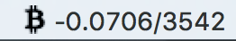

# Electron Practice App

A trap app showing current BTC price, notify user when price drop/up significantly

Currently only support BTC and price is from Bitfinex since they have a better API doc to integrate :smirk:



## Features

- [x] Show currenct bitcoin price at menubar (WebSocket)
- [ ] Send notification when matching certain condition


## Getting Started

```
git clone repo bitcoin-ticker
cd bitcoin-ticker
yarn install
yarn start
```

## Build

Currenctly only tested at Mac

```
yarn build-mac
```

## Licence

MIT